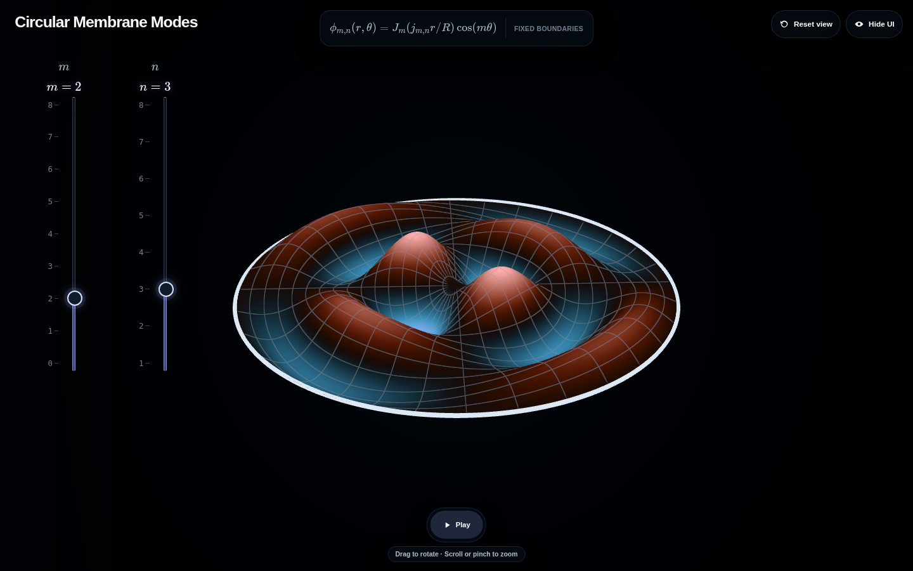

# Circular Membrane Modes

[Open the interactive explorer](https://rayleighlord.github.io/CircularMembraneModes/)

Explore the separated vibration modes of a circular membrane whose perimeter is fixed. Choose the
azimuthal order \(m=0,\ldots,8\) and the radial index \(n=1,\ldots,8\), then rotate and zoom the
retained three-dimensional surface. Height and Fabio Crameri's Berlin colormap both encode the
instantaneous signed displacement, while the mode description reports the corresponding nodal
circle and diameter counts.

[](https://rayleighlord.github.io/CircularMembraneModes/)

## Mode convention

The explorer displays the cosine representative

\[
\phi_{m,n}(r,\theta)=J_m(j_{m,n}r/R)\cos(m\theta),
\]

where \(j_{m,n}\) is the \(n\)-th positive zero of \(J_m\). The fixed boundary is therefore
\(\phi_{m,n}(R,\theta)=0\). The visualization rescales every selected mode to the same unit peak
height and color range, making different shapes easy to compare without changing their nodes. There
is no frequency formula in the interface because the frequency depends on a Bessel zero rather than
a closed-form expression.

Each mode has \(n-1\) interior nodal circles. For \(m>0\), it also has \(m\) nodal diameters and a
degenerate sine partner, obtained by replacing \(\cos(m\theta)\) with \(\sin(m\theta)\). That partner
is the same nodal pattern rotated about the center, so the interface uses one fixed cosine
orientation rather than adding an orientation control.

Animation timing preserves the circular membrane's modal frequency ratios
\(\omega_{m,n}/\omega_{0,1}=j_{m,n}/j_{0,1}\). The fundamental \((m,n)=(0,1)\) mode is calibrated
to a ten-second cycle, and every other mode runs proportionally faster according to its Bessel zero.
This provides meaningful relative timing; assigning physical seconds requires the membrane's radius
and wave speed.

## Development

The project is a static, framework-free Vite and TypeScript application with no backend. It keeps
the relative Vite base needed for deployment at a GitHub Pages repository subpath.

```bash
npm ci
npm run dev
```

Verification commands:

```bash
npm test
npm run typecheck
npm run build
npm run test:browser
npm run benchmark
```

Set `UPDATE_README_SCREENSHOT=1` while running `npm run test:browser` to refresh the browser-created
image above. Third-party attributions are deployed with the app in
[`public/THIRD_PARTY_NOTICES.txt`](public/THIRD_PARTY_NOTICES.txt).
